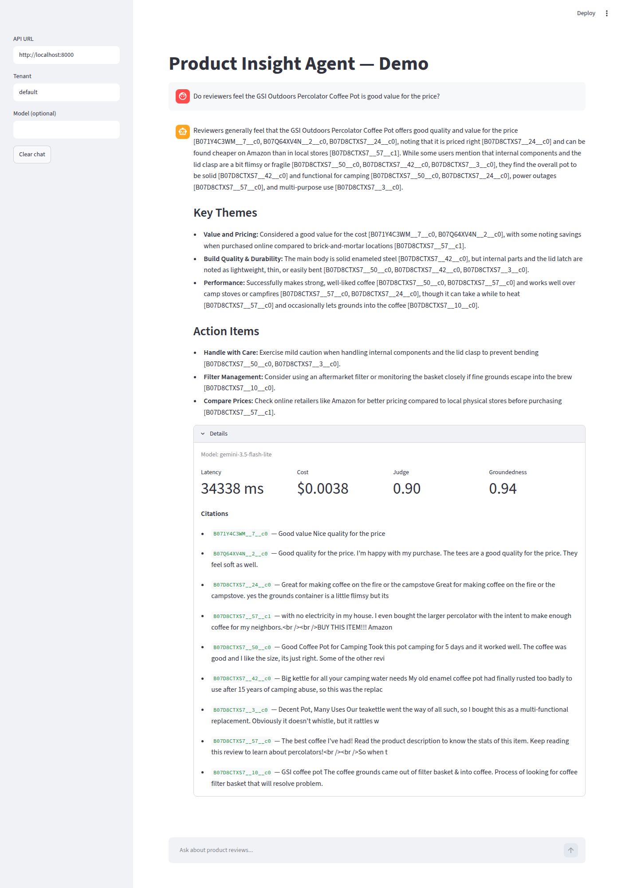
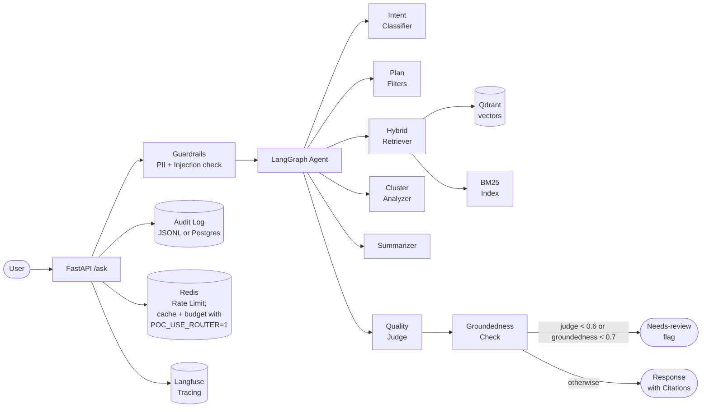
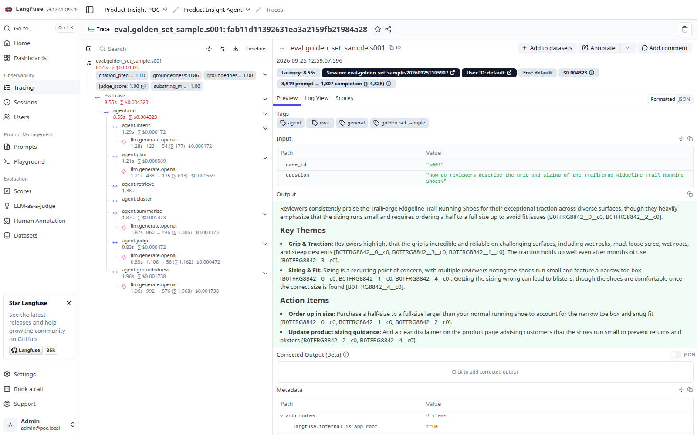
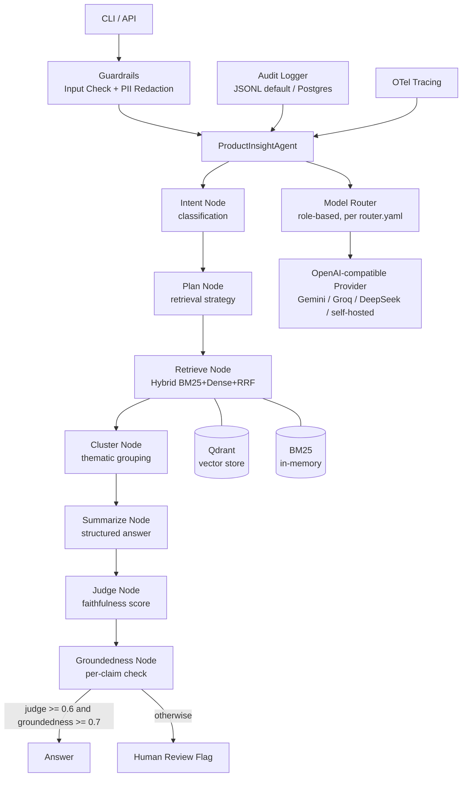

# Product Insight Agent — POC

[](https://github.com/bsamsonov/product-insight-agent/actions/workflows/ci.yml)
[](https://github.com/bsamsonov/product-insight-agent/actions/workflows/eval.yml)

[](LICENSE)

An AI-powered agent that analyses product reviews and surfaces actionable insights using a hybrid retrieval + LangGraph agentic pipeline.

> **About.** A personal R&D proof of concept: an end-to-end agentic RAG system built to
> explore what it takes to run one responsibly: grounded answers with citations, measured
> quality, cost control and observability. Not a production service; known gaps are listed
> honestly in the metrics table below and in [ROADMAP.md](ROADMAP.md).

**Highlights**

- **LangGraph agent** — intent → plan (metadata filters) → hybrid retrieval → keyword
  clustering → cited summary → LLM judge → groundedness check → human-review flag when
  confidence is low.
- **Hybrid retrieval** — Qdrant dense vectors + BM25, both built from the same recorded corpus.
- **Evals** — keyless retrieval smoke-gate on every PR plus a manual LLM-judge run;
  measured numbers (including the misses) published in [docs/evals/](docs/evals/README.md).
- **Cost and safety controls** — per-request and per-tenant-day budget caps, Redis rate
  limit, PII / prompt-injection guardrails, `X-Tenant-Id` allowlist, audit log.
- **Observability** — OpenTelemetry spans exported to Langfuse with per-node cost, tokens
  and quality scores.





## Quickstart

1. `cp .env.example .env` and set `POC_GEMINI_API_KEY` (free at [aistudio.google.com](https://aistudio.google.com/apikey)).
2. `uv sync --all-packages` installs all workspace packages.
3. `docker compose up -d` starts the core infrastructure (Qdrant, Redis, Postgres). Langfuse
   tracing is an optional compose profile: `docker compose --profile observability up -d`
   (see [docs/observability.md](docs/observability.md)).
4. `uv run ask "Say hello"` runs a provider smoke test: one direct LLM call, no retrieval.
5. Index a corpus. You can use the bundled sample (instant) or download the full dataset:
   ```bash
   uv run python scripts/index.py --source data/raw/sample_reviews.jsonl --recreate
   # or: uv run python scripts/download_dataset.py && \
   #     uv run python scripts/index.py --source data/raw/reviews.jsonl --recreate
   ```
   The collection remembers which file it was built from; the API builds its BM25 index from
   the same file, so dense and keyword search always see one corpus (override with
   `POC_CORPUS_PATH`). Switching corpora needs `--recreate`.
6. `uv run uvicorn api.main:app --port 8000`, then ask a question about the indexed corpus:
   ```bash
   # bundled sample
   curl -s localhost:8000/ask -H 'Content-Type: application/json' \
     -d '{"question": "How do reviewers rate the grip of the TrailForge trail running shoes?"}'
   # full dataset
   curl -s localhost:8000/ask -H 'Content-Type: application/json' \
     -d '{"question": "Do reviewers feel the GSI Outdoors Percolator Coffee Pot is good value for the price?"}'
   ```
   Either returns a cited answer from the full LangGraph agent.
7. Optional: `uv run streamlit run apps/ui/streamlit_app.py` opens the UI.

## Dataset

Reviews come from **[McAuley-Lab/Amazon-Reviews-2023](https://huggingface.co/datasets/McAuley-Lab/Amazon-Reviews-2023)**, category `Sports_and_Outdoors`. Download with:

```bash
uv run python scripts/download_dataset.py   # -> data/raw/reviews.jsonl (12,000 reviews, 558 products)
```

**Why this dataset.** The earlier candidate, `mteb/amazon_reviews_multi`, is a *sentiment-classification* benchmark: it keeps only review text plus a star label and strips `product_id`, product name and timestamp. That makes the agent's per-product / per-period analysis (plan → retrieve → cluster → summarize *for a given product*) impossible. The McAuley 2023 dataset keeps `parent_asin` (→ `product_id`), `timestamp` (→ `created_at`) and a metadata table with product titles.

**Sampling.** A category holds 100k+ products, so uniform sampling would yield mostly single-review products — nothing to cluster. `download_dataset.py` instead selects ~600 *popular* products (`rating_number ≥ 50`) and caps reviews per product, producing dense per-product clusters. Each `Document` carries `product_id`, `created_at` and `metadata` (`rating`, `product_title`, `main_category`, `verified_purchase`, …). Change `CATEGORY` at the top of the script to switch domains.

**Data is not included in this repository.** Amazon Reviews 2023 is a research-only
dataset — this repo does not redistribute it. Run `download_dataset.py` (above) to
build your own local `data/raw/reviews.jsonl`, or use the small committed
`data/raw/sample_reviews.jsonl` (50 synthetic reviews across 10 invented products, in the
same schema) to try the pipeline offline without downloading anything. CI runs a keyless
retrieval smoke-gate (hit rate, no LLM calls) on this sample; the full LLM-judge eval is a
manual run. Full attribution: Hou et al.,
*"Bridging Language and Items for Retrieval and Recommendation"*, 2024 — dataset card
at [huggingface.co/datasets/McAuley-Lab/Amazon-Reviews-2023](https://huggingface.co/datasets/McAuley-Lab/Amazon-Reviews-2023).

## Key Metrics

| Metric | Target | Measured |
|--------|--------|----------|
| Faithfulness (LLM judge) | ≥ 0.85 | **0.90** ✅ |
| Citation precision | ≥ 0.70 | **0.59** ❌ |
| Sentences with citations | ≥ 0.85 | **0.84** ≈ |
| Latency (`/ask`, p95 target) | p95 < 8s | **max 11.1 s, p50 10.2 s** over 10 sequential requests (too few for a real p95) ❌ |
| Cost per answer | < $0.02 (free tier: $0) | **$0.002** ✅ |

Full-agent eval on 35 golden-set cases over the full corpus (12,056 chunks), hybrid
retrieval, `gemini-3.1-flash-lite`. Methodology, the BM25-only ablation and what the
misses mean: [docs/evals/](docs/evals/README.md).

## Observability

Every `/ask` request and every eval case is one trace in Langfuse. The trace holds the
LangGraph node tree, each LLM generation with its tokens and cost, and quality scores
(judge verdict, groundedness, eval metrics). Application code only emits OpenTelemetry
spans; the Langfuse SDK is attached to the tracer provider in one place and stays off
until `LANGFUSE_*` is set. Details and setup: [docs/observability.md](docs/observability.md).



## Architecture



## Key Packages

| Package | Purpose |
|---|---|
| `poc-core` | Domain models (`Document`, `Chunk`, `Answer`, `Question`, `Citation`) |
| `poc-llm` | LLM provider abstraction, OpenAI-compatible adapter, model router |
| `poc-ingestion` | JSONL ingest, normalization, token-based chunking |
| `poc-retrieval` | BGE-M3 embedder, Qdrant index, BM25 index, hybrid RRF retrieval |
| `poc-prompts` | YAML prompt registry, `str.format()` placeholders |
| `poc-agent` | LangGraph state machine with intent/plan/retrieve/cluster/summarize/judge nodes |
| `poc-evals` | Eval metrics (faithfulness, answer relevance, context precision/recall, citation precision, groundedness), golden set runner |
| `poc-guardrails` | Input PII redaction, prompt injection detection, output groundedness check |
| `poc-audit` | Append-only async audit log — JSONL (default) or Postgres (`POC_AUDIT_BACKEND`) |
| `poc-observability` | OTel tracing, Langfuse export and scores, JSON logging |
| `poc-api` | FastAPI HTTP API: `X-Tenant-Id` allowlist, per-tenant audit / rate limit / budget (retrieval is single-tenant, see ADR-0005) |

## Requirements

- Python 3.12+
- [uv](https://docs.astral.sh/uv/) >= 0.4
- Docker (for Qdrant, Postgres)

## Getting started

```bash
# Install all workspace dependencies
uv sync --all-packages

# Start infrastructure (Qdrant + Postgres + Redis)
docker compose up -d
# ... plus Langfuse tracing (ClickHouse, MinIO, Langfuse)
docker compose --profile observability up -d

# Run linter
uv run ruff check .

# Run unit tests
uv run pytest tests/unit/

# Index reviews dataset into Qdrant
uv run python scripts/index.py --source data/raw/reviews.jsonl

# Keyless retrieval gate on the bundled sample (what CI runs)
uv run python scripts/run_eval.py --golden-set golden_set_sample \
  --data-path data/raw/sample_reviews.jsonl --retrieval-only --min-hit-rate 0.8

# Full agent eval on the real corpus (needs POC_GEMINI_API_KEY + indexed Qdrant)
uv run python scripts/run_eval.py --golden-set golden_set_v2 \
  --data-path data/raw/reviews.jsonl --agent \
  --metrics citation_precision,groundedness_heuristic,faithfulness,answer_relevance

# Start the API server
uv run uvicorn api.main:app --port 8000
```

## Environment variables

See [`.env.example`](.env.example) for the full list. Minimum required:

```
POC_GEMINI_API_KEY=<key>   # free tier — https://aistudio.google.com/apikey
LOG_LEVEL=INFO
ENV=dev
```

The default LLM provider is resolved from `POC_DEFAULT_PROVIDER` (falls back to
`gemini`); the router works with any OpenAI-compatible endpoint, including
self-hosted gateways — see
[docs/adr/0008-multi-provider-llm-strategy.md](docs/adr/0008-multi-provider-llm-strategy.md).

### Cost & routing mode (S3)

Set `POC_USE_ROUTER=1` to route every agent node through `RoutedLLM`
([`packages/llm/data/router.yaml`](packages/llm/data/router.yaml)):

- **role-based model selection** — intent speaks as `classifier` (cheap/fast),
  summarize as `summarizer` (strong), judge as `judge`; models and providers per
  role live in router.yaml, not in code;
- **automatic fallback** — a 429/503 from the primary provider switches the call
  to the fallback provider without failing the request;
- **judge escalation** — a low-confidence verdict (score < 0.5) is re-judged once
  through the stronger `escalate` route;
- **response cache** — identical calls are served from Redis (`POC_REDIS_URL`);
  provider-side prompt-cache hits are surfaced as `cached_input_tokens`;
- **budget caps** — per-request and per-tenant-day USD limits (from
  `budgets:` in router.yaml) enforced via Redis counters; a breach maps to
  HTTP 429 (`budget_exceeded`). Without `POC_REDIS_URL` the router degrades to
  in-memory cache/budget (dev only).

## Structure

```
apps/
  api/          FastAPI application
packages/
  core/         Shared models and utilities
  llm/          LLM client abstraction
  prompts/      Prompt templates
  retrieval/    Vector search / RAG
  ingestion/    Data ingestion pipeline
  agent/        Agent orchestration
  guardrails/   Input/output safety
  observability/ Tracing and metrics
  audit/        Audit logging
  evals/        Evaluation harness
```

## Documentation

| Document | Description |
|----------|-------------|
| [`ROADMAP.md`](ROADMAP.md) | Known gaps and next steps |
| [`docs/adr/`](docs/adr/) | Architecture Decision Records (8 ADRs) |
| [`docs/observability.md`](docs/observability.md) | Tracing design, Langfuse setup, scores |
| [`docs/cost-model.md`](docs/cost-model.md) | Cost projections at various QPS levels |
| [`docs/security/redteam-report.md`](docs/security/redteam-report.md) | OWASP LLM Top-10 assessment |
| [`docs/demo/script.md`](docs/demo/script.md) | End-to-end demo walkthrough |
