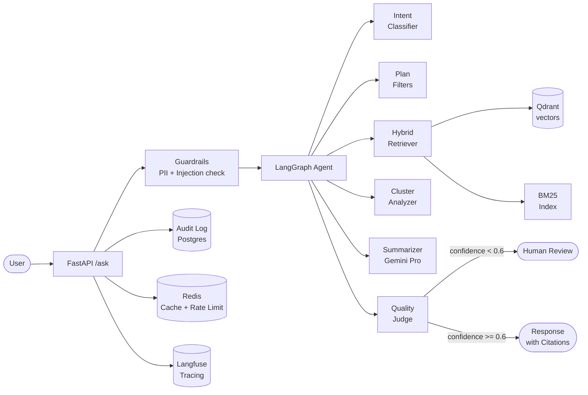
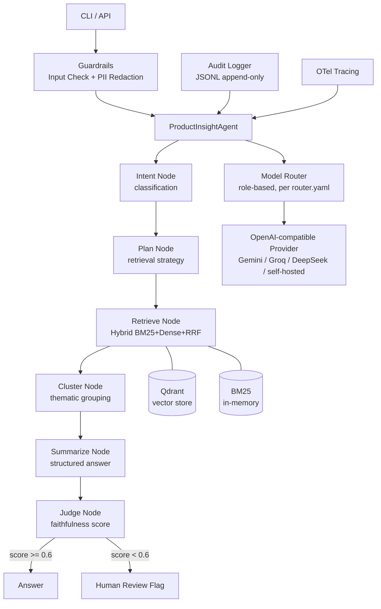

# Product Insight Agent — POC

An AI-powered agent that analyses product reviews and surfaces actionable insights using a hybrid retrieval + LangGraph agentic pipeline.



## Quickstart

1. `cp .env.example .env` — fill in at minimum `POC_GEMINI_API_KEY` (free at [aistudio.google.com](https://aistudio.google.com))
2. `docker compose up -d` — starts Qdrant, Redis, Postgres, Langfuse
3. `uv sync` — install all dependencies
4. `uv run python scripts/index.py --source data/raw/reviews.jsonl --tenant default --limit 1000` — index sample data
5. `uv run ask "What do customers say about hair and skincare products?"` — CLI test
6. `uv run uvicorn api.main:app --port 8000` — start API
7. Optional: `streamlit run apps/ui/streamlit_app.py` — launch UI

A new user who follows these steps should have a working local instance and their first answer within 30 minutes.

## Dataset

Reviews come from **[McAuley-Lab/Amazon-Reviews-2023](https://huggingface.co/datasets/McAuley-Lab/Amazon-Reviews-2023)**, category `All_Beauty`. Download with:

```bash
uv run python scripts/download_dataset.py   # -> data/raw/reviews.jsonl (~11k reviews, 600 products)
```

**Why this dataset.** The earlier candidate, `mteb/amazon_reviews_multi`, is a *sentiment-classification* benchmark: it keeps only review text plus a star label and strips `product_id`, product name and timestamp. That makes the agent's per-product / per-period analysis (plan → retrieve → cluster → summarize *for a given product*) impossible. The McAuley 2023 dataset keeps `parent_asin` (→ `product_id`), `timestamp` (→ `created_at`) and a metadata table with product titles.

**Sampling.** A category holds 100k+ products, so uniform sampling would yield mostly single-review products — nothing to cluster. `download_dataset.py` instead selects ~600 *popular* products (`rating_number ≥ 50`) and caps reviews per product, producing dense per-product clusters. Each `Document` carries `product_id`, `created_at` and `metadata` (`rating`, `product_title`, `main_category`, `verified_purchase`, …). Change `CATEGORY` at the top of the script to switch domains.

**Data is not included in this repository.** Amazon Reviews 2023 is a research-only
dataset — this repo does not redistribute it. Run `download_dataset.py` (above) to
build your own local `data/raw/reviews.jsonl`, or use the small committed
`data/raw/sample_reviews.jsonl` (50 real, hand-checked reviews across 10 products) to
try the pipeline offline without downloading anything. Full attribution: Hou et al.,
*"Bridging Language and Items for Retrieval and Recommendation"*, 2024 — dataset card
at [huggingface.co/datasets/McAuley-Lab/Amazon-Reviews-2023](https://huggingface.co/datasets/McAuley-Lab/Amazon-Reviews-2023).

## Key Metrics

| Metric | Target |
|--------|--------|
| Faithfulness | ≥ 0.85 |
| Citation precision | ≥ 0.70 |
| Groundedness | ≥ 0.85 |
| p95 latency | < 8s |
| Cost per request | < $0.02 (free tier: $0) |

## Architecture



## Key Packages

| Package | Purpose |
|---|---|
| `poc-core` | Domain models (`Document`, `Chunk`, `Answer`, `Question`, `Citation`) |
| `poc-llm` | LLM provider abstraction, OpenAI-compatible adapter, model router |
| `poc-ingestion` | JSONL ingest, normalization, token-based chunking |
| `poc-retrieval` | BGE-M3 embedder, Qdrant index, BM25 index, hybrid RRF retrieval |
| `poc-prompts` | YAML prompt registry with Jinja2-style rendering |
| `poc-agent` | LangGraph state machine with intent/plan/retrieve/cluster/summarize/judge nodes |
| `poc-evals` | Eval metrics (faithfulness, citation precision/recall), golden set runner |
| `poc-guardrails` | Input PII redaction, prompt injection detection, output groundedness check |
| `poc-audit` | Append-only async audit log (JSONL) |
| `poc-observability` | OTel tracing setup, JSON logging |
| `poc-api` | FastAPI HTTP API with tenant resolution and audit logging |

## Requirements

- Python 3.12+
- [uv](https://docs.astral.sh/uv/) >= 0.4
- Docker (for Qdrant, Postgres)

## Getting started

```bash
# Install all workspace dependencies
uv sync --all-packages

# Start infrastructure (Qdrant + Postgres)
docker compose up -d postgres qdrant

# Run linter
uv run ruff check .

# Run unit tests
uv run pytest tests/unit/

# Index reviews dataset into Qdrant
uv run python scripts/index.py --source data/raw/reviews.jsonl

# Run eval on golden set (BM25-only, no Qdrant needed)
uv run python scripts/run_eval.py \
  --golden-set packages/evals/data/golden_set_v0.jsonl \
  --data-path data/raw/reviews.jsonl \
  --output eval_results.json \
  --skip-faithfulness

# Start the API server
uv run python apps/api/src/api/main.py
```

## Environment variables

See [`.env.example`](.env.example) for the full list. Minimum required:

```
POC_GEMINI_API_KEY=<key>   # free tier — https://aistudio.google.com/apikey
LOG_LEVEL=INFO
ENV=dev
```

The default LLM provider is resolved from `POC_DEFAULT_PROVIDER` (falls back to
`gemini`); the router works with any OpenAI-compatible endpoint, including
self-hosted gateways — see
[docs/adr/0008-multi-provider-llm-strategy.md](docs/adr/0008-multi-provider-llm-strategy.md).

## Structure

```
apps/
  api/          FastAPI application
packages/
  core/         Shared models and utilities
  llm/          LLM client abstraction
  prompts/      Prompt templates
  retrieval/    Vector search / RAG
  ingestion/    Data ingestion pipeline
  agent/        Agent orchestration
  guardrails/   Input/output safety
  observability/ Tracing and metrics
  audit/        Audit logging
  evals/        Evaluation harness
```

## Documentation

| Document | Description |
|----------|-------------|
| [`docs/adr/`](docs/adr/) | Architecture Decision Records (7 ADRs) |
| [`docs/cost-model.md`](docs/cost-model.md) | Cost projections at various QPS levels |
| [`docs/security/redteam-report.md`](docs/security/redteam-report.md) | OWASP LLM Top-10 assessment |
| [`06_implementation_plan.md`](docs/planning/06_implementation_plan.md) | Full sprint plan with acceptance criteria |
| [`poc_eval_mini/`](poc_eval_mini/README.md) | Standalone "for understanding" mini-PoC: a 3-node LangGraph (retrieve → agent → critic) with an optional agentic reflection loop. Isolated from `poc.*`; borrows only the data, `.env` and LLM provider |
